<!-- markdownlint-disable MD033 -->

# Uproot

uprt (uproot) is a multi-platform (Windows, MacOs, and Linux) command line utility written in Dart to convert static leases between routers. Currently only ip4 static leases are supported.

Current router/firewall software supported:

* DD-WRT
* Json
* Mikrotik RouterOS
* OPNSense
* OpenWrt
* pfSense

Also supports the following file formats:

* json
* csv

## Features

* Automatic detection of input format based on extension and content; optionally you can specify the format
* Single input file can be simultaneously converted into multiple formats
* Csv and Json input files
* Validation Checks which remove errors in importing:
  * Validation of output format type
  * Enforced IP range
  * Enforced Checking if each static lease has an IP, Mac,and Host address
  * Duplicate Lease Checking, excluding duplicates from output
  * Validates ip and mac addresses from input file and excludes invalid addresses from the output file
* Example input files available in source download for testing

## Installation

Binaries are included for macOS, Linux, and Windows for the latest releases. Simply download to your respective platform and put in your path.

## Compiling

If you choose to compile yourself:

1. Open a terminal.
2. Install the latest version of [Dart](https://dart.dev/get-dart) for your operating system.
3. Clone the repository (you'll need a [personal access](https://docs.github.com/en/get-started/getting-started-with-git/about-remote-repositories#cloning-with-https-urls) token if by https). Alternatively, download the zip file).

   Example:

    ````bash
    git clone https://github.com/GeekVisit/uproot.git
    ````

4. Type the following:

    ````bash
    cd uproot/bin

    dart compile exe uprt.dart -o uprt
    ````

## Use

For a complete list of options, simply type `uprt` or `uprt -h`

Below is the latest help (version 2021.09.001):

````bash

uprt (2021.09.001 running on windows "Windows 10 Pro" 10.0 (Build 19042))

A tool to migrate static leases between DD-WRT, OpenWrt, OPNsense, Mikrotik, and pfSense routers. Also supports cvs and json.

Usage:
-L, --ip-low-address     Ip4 Lowest Address of Network Range
-H, --ip-high-address    Ip4 Highest Address of Network Range
-i, --input-file         Input File to be converted
-t, --input-type         Input file type:   c (csv), d (ddwrt), j (json),m (mikrotik), 
                         n (opnsense), o (openwrt), p (pfsense)
-d, --directory-out      Directory to write files to, defaults to current directory.
-s, --server             Name to designate in output file for Mikrotik dhcp server.
                         (defaults to "defconf")
-w, --[no-]write-over    Overwrite output files, if left out, will not overwrite
-h, --[no-]help          Help
-g, --generate-type      Generated types may be multiple. Valid values include:  c (csv), d (ddwrt), j (json),m (mikrotik), n (opnsense), o (openwrt), p (pfsense)
-b, --base-name          Base Name of Output Files
-l, --[no-]log           Creates Log file, if -p not set, then location is in system temporary folder
-p, --log-file-path      Log error messages to specified file path.
-v, --[no-]verbose       Verbosity - additional debugging messages

Examples:

  Convert a csv file to all formats (csv, json, DD-WRT, Mikrotik, OpenWrt, OPNsense, pfSense): 

  uprt -i test/test-data/lease-list-infile.csv -b converted-output -g cdjmnop -L 192.168.0.1 -H 192.168.0.254 -d test/test-output

  Convert Mikrotik file to json:

  uprt -i test/test-data/lease-list-infile.rsc -b converted-output -g j -L 192.168.0.1 -H 192.168.0.254  -d test/test-output

````

## Test Data Included

To test uprt yourself, there are test input files located under the `test/test-data` folder in the repository. Simply open a terminal, clone the repository, cd into the uproot directory and apply the examples given in `uprt -h` on the test files.

## Video Demo

Below is a demonstration done on Mac Catalina showing the conversion from a .csv file to all formats.
After the conversion the demo scrolls through the resulting files.


# Exporting amd Importing Static Leases

To use Uproot, you'll need to export and import static leases to the respective routers.

Below are the export/import steps for each router/firewall type that is supported by Uproot.

## DD-WRT

### DD-WRT - Export

1. Ssh into your router and enter the following on the command line to export static leases to a file:

    ````bash
    nvram get static_leases > static_leases.ddwrt
    ````

2. Download the `static_lease.ddwrt` file from the router by using [WinScp](https://winscp.net) or a similar utility. If you do use WinScp, use the SCP protocol.

3. Alternatively you can simply execute `nvram get static_leases` and copy the output from the terminal, paste it into a text file and save it locally.

4. Now use the exported file as an input file to Uproot and convert to your required format.

      **Example:**
  
      Converting from DD-WRT format to OpenWrt format, with static leases having range of 192.168.0.1 to 192.168.0.254:

      ````bash
      uprt -i static_leases.ddwrt -b static_leases -g o -L 192.168.0.1 -H 192.168.0.254  
      ````

### DD-WRT - Import

1. **NOTE: Always Make a [backup](https://support.flashrouters.com/setup-guides/dd-wrt-features/how-to-save-and-load-a-backup-file/) of your DD-WRT software configuration before importing (via backup tab in the Web interface).**All imports will REPLACE your existing static leases.****

2. Using WinSCP (if on Windows) or a similar utility, login to your router and upload the `static_leases.ddwrt` file to the router.

3. Using [Putty](https://www.putty.org/) if on Windows, or other ssh command line client, type the following, and press `Enter`,replacing "X" with the number of static leases you are importing.

    ```bash
    nvram set static_leasenum=X
    ````

4. Type the following and press `Enter`.  Note that the quotes are important:

    ````bash
    nvram set static_leases="$(cat static_leases.ddwrt)"
    nvram commit
    ````

5. Reboot the router. Your static leases should appear under the `Services` tab in the browser interface.

6. **TIP:** If you have any issues with the above, log in using your browser to your router and view the changes as you make them. For instance, you can click on the `Services` tab and view the static leases after you set the nvram variable. If the `nvram commit` doesn't work try clicking "Save" and then "Apply Settings" in the browser interface.

### Video Demo of DD-WRT Import

[](https://www.youtube.com/embed/c-3m4Lm-XjA)

## OpenWrt

### OpenWrt - Export

1. Using [Putty](https://www.putty.org/) if on Windows, or other ssh command line client, log into your router and type the following:

    ````bash
        grep -hnr -A3 "config host" /etc/config/dhcp > static_leases.openwrt
    ````

2. Check if the resulting contains the static leases:

    ````bash
      cat static_leases.openwrt
    ````

3. To confirm you have all the proper attributes for the static leases, open the /etc/config/dhcp file in vim and compare the resulting output with the "config host" sections in /etc/config/dhcp.

4. Using [scp](https://linuxize.com/post/how-to-use-scp-command-to-securely-transfer-files/) or [WinScp](https://winscp.net) if on Windows, download the `static_leases.openwrt` file.

5. Use the exported file as an input file to Uproot and convert to your required format.

    **Examples:**

    Converting DD-WRT to a json file

    ````bash
      uprt -i static_leases.ddwrt -b static_leases -g j -L 192.168.0.1 -H 192.168.0.254  
    ````

    Converting DD-WRT to a Mikrotik RouterOS import script

    ````bash
      uprt -i static_leases.ddwrt -b static_leases -g m -L 192.168.0.1 -H 192.168.0.254 -s defconf 
    ````

### OpenWrt - Import

1. **NOTE: Always Make a [backup](https://openwrt.org/docs/guide-user/troubleshooting/backup_restore) of your Openwrt Router Files before importing! All imports will REPLACE your existing static leases.**

2. Using [WinSCP](https://winscp.net/) (if on Windows) or a similar scp utility, login to your router and upload the file to be imported to the router (`static_leases.openwrt` in the Open-WRT export example).

3. Using Putty or other ssh command line client, enter the following two lines:

    ````bash
        cp /etc/config/dhcp /etc/config/dhcp.original
        cat *infile.openwrt >> /etc/config/dhcp
    ````

    **WARNING: Be sure that there are two `>>`, otherwise the dhcp file will be overwritten instead of appended. Thus the recommended backup!**

4. Reboot the router. Your static leases should appear under the `Services` tab in the browser interface.

5. **TIP:** If you have any issues with the above, login using your browser to your router. Static leases should appear in `Network->DHCP and DNS->Static Lease`.  If you don't see the imported leases, repeat steps, viewing the browser window as you make them. After the static leases appear, click `Save & Apply` on the`DHCP and DNS` web page.

### Video Demo of Open-WRT import

  [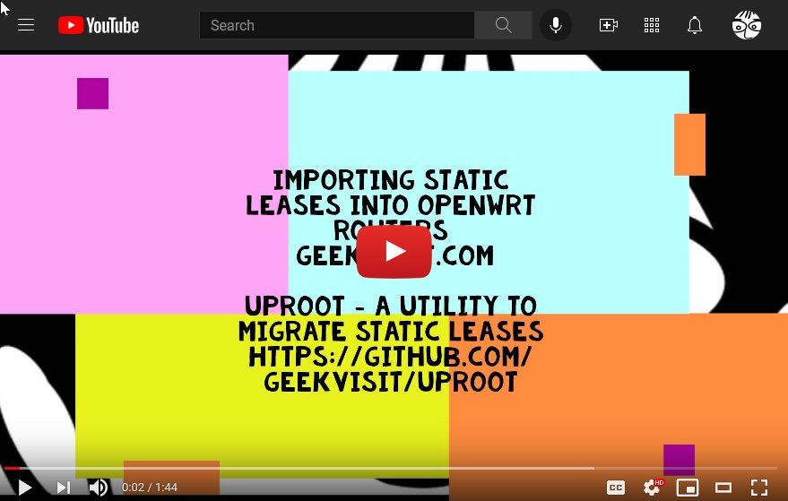](https://www.youtube.com/embed/c-3m4Lm-XjA)

## OPNsense - Exporting

1. Log in to your OPNsense router and navigate to System->Configuration->Backups.

2. Click on the big "Download configuration" button and download the file.

    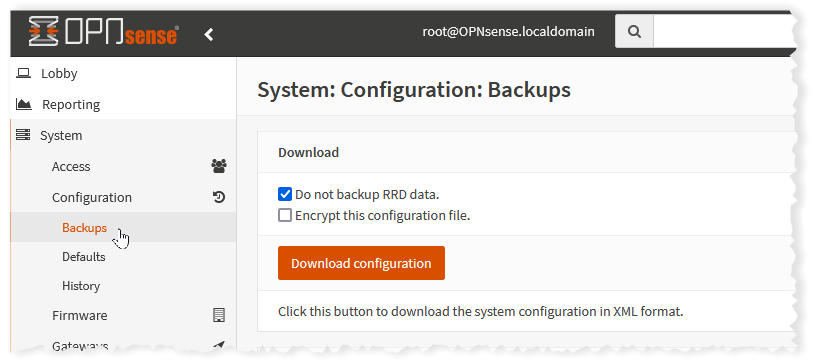

3. The backup file you've downloaded contains **AlL** backup data for the router. As of this writing, the OPNSense configuration does not allow partial backups of data (although it does allow partial restores).  Since you only need the data in the static map tags and their parents and related closing tags, you can delete all tags unrelated to the static lease export.  Preserve the static map tags and the other tags shown in the below example, but delete all others:
  
    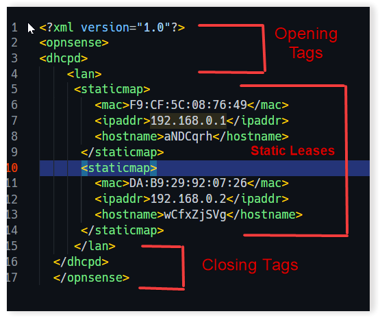

4. Use the exported file as an input file to Uproot and convert to your required format.

    **Example:**

     Converting OPNSense to pfSense

    ````bash
      uprt -i static_leases-opn.xml -b static_leases -g p -L 192.168.0.1 -H 192.168.0.254  
    ````

## OPNsense - Importing

1. **NOTE: Always make a [backup](https://docs.opnsense.org/manual/backups.html) of your OPNsense configuration before importing !**

2. **In addition, importing REPLACES any static leases you currently have. See [below](#user-content-OpnSense--adding-leases-to-an-existing-pfSense-configuration) if you just are adding leases to an existing configuration.**

3. To start your import, log in to your OPNsense router and navigate to System->Configuration->Backups.

4. Click on the big "Download configuration" button and download the file.

    

5. In the `Restore` section under the `Restore Area` click on the drop down arrow and change `All` to `DHCP Server`. Click on `Browse ..." and select the file to be imported. Then click "Restore configuration".

    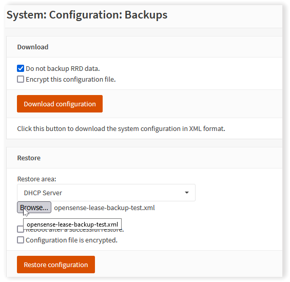

6. OPNSense should respond with a "Successful" message.

7. To view the imported leases, navigate to Services->DHCPv4->[LAN].

8. Scroll down and verify the static leases have been imported.

   

## pfSense - Exporting

1. Log into pfSense using your browser and navigate to Diagnostics->Backup & Restore:

    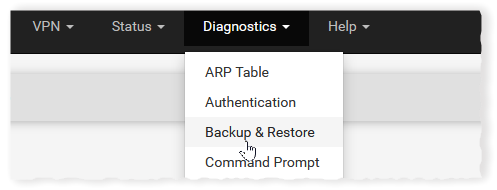

2. Scroll down to `Backup Configuration` and set `Backup area` to `DHCP Server`. Click `Download configuration as XML`.

    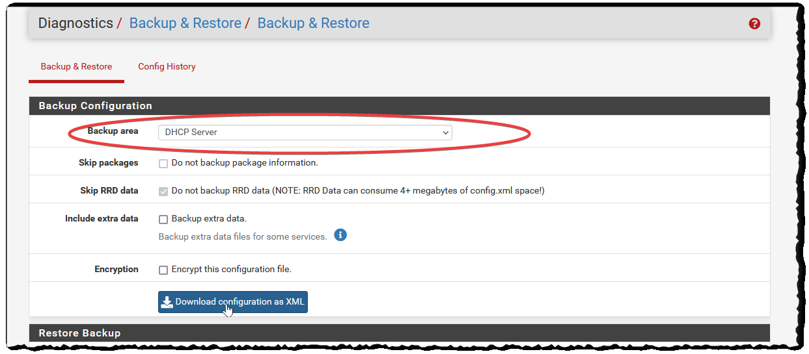

3. Use the exported file as an input file to Uproot and convert to your required format.

    **Example**

     Convert pfSense to OPNsense:

    ````bash
    uprt -i static_leases-pfs.xml -b static_leases -g p -L 192.168.0.1 -H 192.168.0.254  

    ````

### OpnSense - Adding Leases to An Existing Configuration

If you are ADDING leases to an existing OpnSense configuration, you'll need to download a backup from your existing configuration, select and copy all the "staticmap" tags from your backup, and paste them into your import file so your import file is in this format:


## pfSense - Importing

1. **NOTE: Always make a [backup](https://docs.netgate.com/pfsense/en/latest/backup/index.html) of your pfSense configuration before importing !**

2. **In addition, importing REPLACES any static leases you currently have. See [below](#user-content-pfSense--adding-leases-to-an-existing-pfSense-configuration) if you just are adding leases to an existing configuration.**

3. Log into pfSense using your browser and navigate to Diagnostics->Backup & Restore:

    

4. In the `Restore` section under the `Restore Area` click on the drop down arrow and change `All` to `DHCP Server`.

5. Click on `Browse ..." and select the file to be imported. Then click "Restore Configuration".

    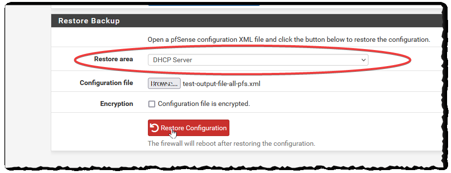

6. pfSense should respond with a "The configuration area has been restored. The firewall may need to be rebooted."

7. To verify the leases have been imported, navigate to Services->DHCP Server. Click on the LAN tab and scroll down to the "DHCP Static Mappings for this Interface" section where your imported leases should appear:

   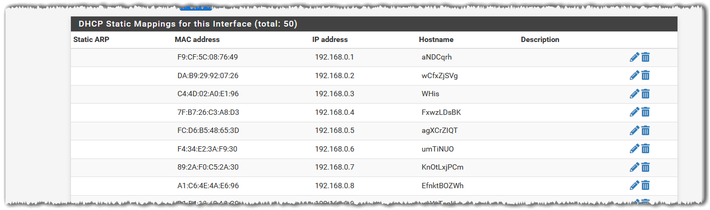

### pfSense - Adding Leases to An Existing Configuration

If you are ADDING leases to an existing pfSense configuration, you'll need to download a backup from your existing configuration, select and copy all the "staticmap" tags from your backup, and paste them into your import file so your import file is in this format:

  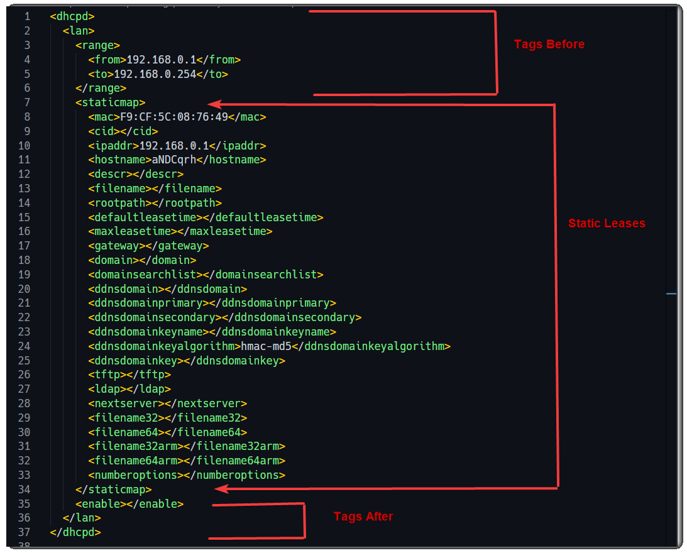
   

## Mikrotik - Exporting

1. Open [Winbox](https://mikrotik.com/download)  or the [Webfig](https://help.mikrotik.com/docs/display/ROS/Webfig) url.

2. Open `New Terminal` from the menu in Winbox, or in Webfig click on the `Terminal` button on the top.

3. Execute the following:

    ````bash
    /ip dhcp-server lease export file=dhcp-static-leases.rsc
    ````

4. This exports a file called "dhcp-static-leases.rsc" which will appear in `Files`.

    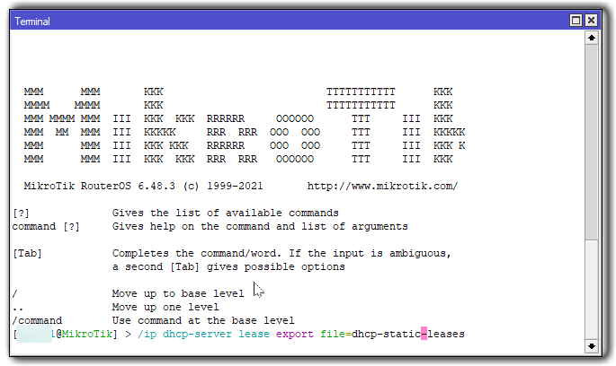)

5. Click on the `Files` menu item.

    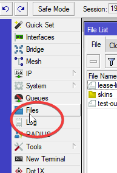)

6. Download the `dhcp-static-leases.rsc` to your computer.

    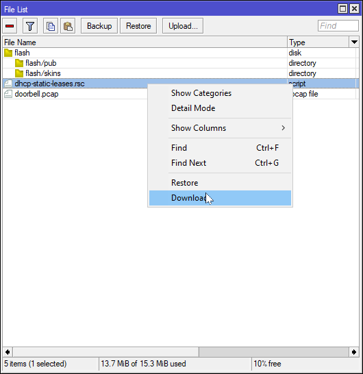

7. Use the exported file as an input file to Uproot and convert to your required format.

    **Example: Convert Mikrotik RouterOS file to pfSense**

    ````bash
      uprt -i dhcp-static_leases.rsc -b static_leases -g p -L 192.168.0.1 -H 192.168.0.254  
    ````

## Mikrotik - Importing

1. Open [Winbox](https://mikrotik.com/download) or the [Webfig](https://help.mikrotik.com/docs/display/ROS/Webfig) url.

2. Select `Files` from the menu and upload your input file (or just drag and drop your file if using Winbox).

      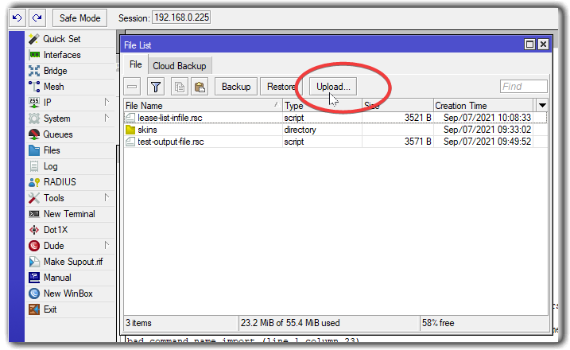

3. Open `New Terminal` from the menu in Winbox, or in Webfig click on the `Terminal` button on the top.

4. Execute the following, changing the name of the input file as needed:

    ````bash
    /import file=dhcp-static-leases.rsc
    ````

5. The terminal should respond "Script file loaded and executed successfully".

    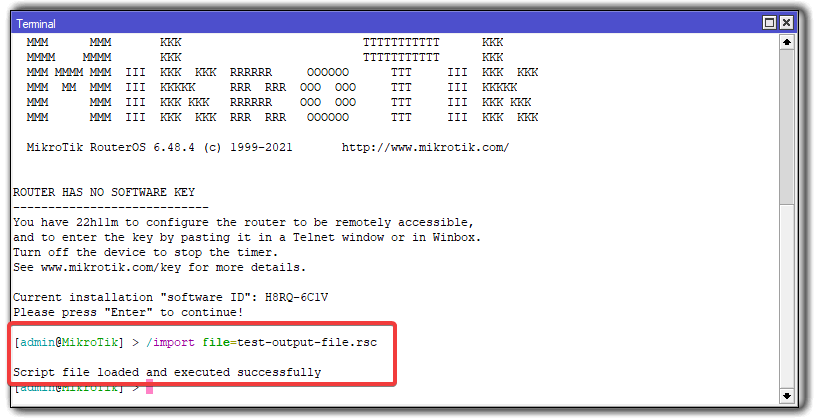

6. Common Error Messages:

    * **"Already have a static lease for this client"** - Edit the input file to delete the lease.
    * **"input does not match any value of server"** - Most likely the DHCP server named in your input file is different from your Mikrotik RouterOS configuration. Either change the name of the DHCP Server (in Winbox, IP->DHCP Server->DHCP  and click on server), or edit the input file.  Uprt also has a "-s" option to set the server name when converting to Mikrotik RouterOS files.

7. Verify all leases are imported by navigating to IP->DHCP Server and clicking the `Leases` tab.

    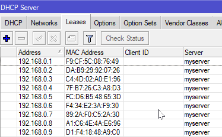

    Or, alternatively, by using the terminal:
  
      ````bash
      /ip dhcp-server lease print
      ````
