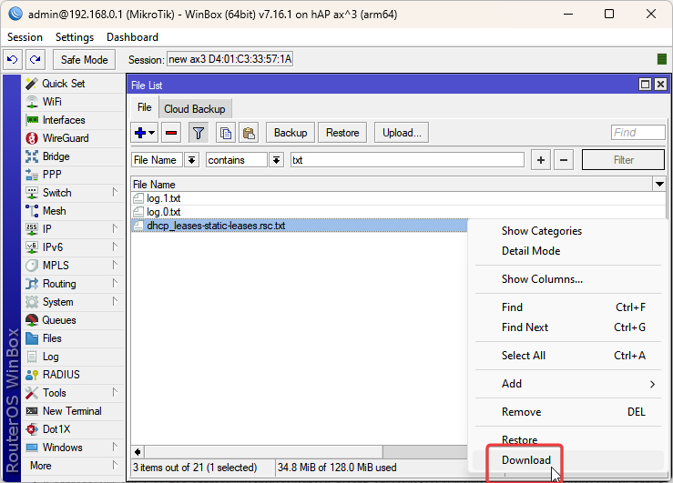

<!-- markdownlint-disable MD033 -->

# UPROOT

uprt (uproot) is a multi-platform (Windows, MacOs, and Linux) command line utility written in Dart to convert static leases between routers. **Currently only ip4 static leases are supported.**

## [DOWNLOAD](https://github.com/GeekVisit/uproot/releases/tag/v2021-10-001-beta)

:floppy_disk [Download binaries](<https://github.com/GeekVisit/uproot/releases/tag/v2021-10-001-beta>)

[Windows, Mac, and X86 Linux Binaries](<https://github.com/GeekVisit/uproot/releases/tag/v2021-10-001-beta>)

Like this project ? Please click the star at the top of this page.

## Current router/firewall software supported

* DD-WRT
* Mikrotik RouterOS
* OPNSense
* OpenWrt
* pfSense

Also supports the following file formats:

* json
* csv

## Features

* Detection of input format based on extension (can also manually specify the format)
* Converts to multiple formats simultaneously
* Merges static leases from one file into another
* Optionally sorts static leases by IP addresses
* Validates lease to avoid import errors:
  * Validates all generated files against expected output type
  * Enforces IP range (optional)
  * Excludes unnecessary duplicates from output
  * Excludes invalid ip4 and Mac addresses from output
* Example input files available in source for testing

## Limitations

* Mikrotik RouterOS format does not yet support hostnames for Mikrotik leases (i.e., all output rsc files are generated without hostnames)
* Does not support ip6 leases

## Installing

Binaries are included for macOS, Linux, and Windows for the latest releases. Simply download to your respective platform and put in your path.

## Compiling

If you choose to compile yourself:

1. Open a terminal.
2. Install the latest version of [Dart](https://dart.dev/get-dart) for your operating system.
3. Clone the repository (you'll need a [personal access](https://docs.github.com/en/get-started/getting-started-with-git/about-remote-repositories#cloning-with-https-urls) token if by https).

   Example:

    ````bash
    git clone https://github.com/GeekVisit/uproot.git
    ````

4. Pull down the dependencies:

    ````bash
      cd uproot
      dart pub get
    ````

5. Run all tests (optional):

    ````bash
      dart test
    ````
  
6. Change into the bin directory and compile:

    ````bash
    cd bin
    dart compile exe uprt.dart -o uprt   [or -o uprt.exe on windows]
    ````

7. If on Linux or Mac, set permission and copy into bin directory in path:

   ```bash
      sudo chmod 700 ./uprt      
      sudo cp ./uprt  /usr/local/bin/uprt
      sudo chown $(whoami) /usr/local/bin/uprt
   ````

8. If on Windows, make sure `uprt.exe` is in a folder that is in your PATH environmental variable. If not, move it to the appropriate path or [add the directory](https://www.architectryan.com/2018/03/17/add-to-the-path-on-windows-10/).

9. Test the binary with included test files:

    ```bash
      cd .. [so you are in the uproot folder]
      uprt test/test-data/lease-list-infile.csv -g cdjmnop -d test/test-output

   ````

## Use

For a complete list of options, type `uprt` or `uprt -h`

Below is the latest help:

````bash

uprt (2021.10.001 running on macos 10.15.7)


A tool to migrate static leases between DD-WRT, OpenWrt, OPNsense, Mikrotik, and pfSense routers. Also supports csv and json.

Usage:
-a, --append                              Used when --merge and --sort are given.  If this flag is given, the merged file
                                          will have the sorted leases from the source file appended to the end of the
                                          target file leases rather than integrated with the merge file.
-b, --base-name                           Specify Base Name of Output Files (default uses basename of input file)
-d, --directory-out                       Directory to write files to, defaults to same directory as input file.
-h, --help                                Help
-t, --input-type                          Input file type:   c (csv), d (ddwrt), j (json),
                                          m (Mikrotik RouterOS), n (OPNsense), o (OpenWrt), p (pfsense)
                                          If this option is not used, uprt will try to determine file
                                          type based on the following extensions: .csv, .ddwrt,
                                          .json, .rsc (mikrotik), .xml (for opnsense and pfsense,
                                          distinguishing by searching for <opnsense> in file)
-g, --generate-type                       Required. Generated types may be multiple. Valid values include:
                                          c (csv), d (DD-WRT), j (json),
                                          m (Mikrotik RouterOS), n (OPNsense), o (OpenWrt), p (pfsense)
-L, --ip-low-address                      Enforced Lowest Ip of Network Range, Excludes Addresses Lower Than This From Target File
-H, --ip-high-address                     Enforced Highest Ip of Network Range, Excludes Addresses Higher Than This From Target File
-l, --log                                 Creates Log file, if -P not set, then location is in temp folder
-P, --log-file-path                       Full file path to log file.
-m, --merge                               Merge to file. Specify path to file to merge converted output.
                                          Used to add static leases to an existing output file.
-S, --server                              Name to designate in output file for Mikrotik dhcp server.
                                          (defaults to "defconf")
-r, --replace-duplicates-in-merge-file    Applies only when using --merge. If this option is set and the source file
                                          has a static lease which has the same mac address, ip or hostname as a lease in
                                          the merge file, the lease or leases in the merge file that have any of the
                                          duplicate components will be discarded and the input lease will be used.
                                          By default, this is set to false so any lease in the input file that has the
                                          same ip, hostname, or mac address as one in the merge file is discarded.
-s, --[no-]sort                           Leases in resulting output file are sorted by Ip address.
                                          (defaults to on)
-v, --verbose                             Verbosity - additional messages
-z, --verbose-debug                       Verbosity - debug level verbosity
-V, --version                             Gives Version
-w, --write-over                          Overwrites output files, if left out, will not overwrite
````

***Examples:***

**Convert a csv file to all formats (csv, json, DD-WRT, Mikrotik, OpenWrt, OPNsense, pfSense):**

  ````bash
    uprt test/test-data/lease-list-infile.csv -g cdjmnop -d test/test-output
  ````

  **Convert multiple csv files to PfSense and save output to a specified directory:**

  ````bash
    uprt test/test-data/*.csv -g p -d test/test-output
  ````

**Convert a csv file to all formats, stripping out leases not in range and saving output to specified directory:**

````bash
  uprt test/test-data/lease-list-infile.csv -g cdjmnop -L 192.168.0.1 -H 192.168.0.254 -d test/test-output
````

**Merging leases in a CSV file with an existing DDWRT file and generating an OpnSense file:**

````bash
    uprt test/test-data/lease-list-infile.csv -m test/test-merge/lease-list-infile-merge.ddwrt -g n -b example-merge-output -d test/test-output
````

**Make a full backup of your router/firewall before importing any files generated by uprt. Use of uprt and files generated by uprt is entirely at user's risk.**

## Test Data Included

To test uprt yourself, there are test input files are located under the `test/test-data` folder in the repository. Cd into the uproot directory and apply the examples given in `uprt -h` on the test files.

## Video Demo

Below is a demonstration done on Mac Catalina showing the conversion from a .csv file to all formats.
After the conversion the demo scrolls through the resulting files.


# Exporting amd Importing Static Leases

To use Uproot, you'll need to export and import static leases to the respective routers.

Below are the export/import steps for each router/firewall type that is supported by Uproot.

## DD-WRT

### DD-WRT - Export

1. Ssh into your router and enter the following on the command line to export static leases to a file:

    ````bash
    nvram get static_leases > static_leases.ddwrt
    ````

2. Download the `static_lease.ddwrt` file from the router by using [WinScp](https://winscp.net) or a similar utility. If you do use WinScp, use the SCP protocol.

3. Alternatively you can simply execute `nvram get static_leases` and copy the output from the terminal, paste it into a text file and save it locally.

4. Now use the exported file as an input file to Uproot and convert to your required format.

      **Example:**
  
      Converting from DD-WRT format to OpenWrt format, with static leases having range of 192.168.0.1 to 192.168.0.254:

      ````bash
      uprt static_leases.ddwrt -g o -L 192.168.0.1 -H 192.168.0.254  
      ````

### DD-WRT - Import

1. **NOTE: Always Make a [backup](https://support.flashrouters.com/setup-guides/dd-wrt-features/how-to-save-and-load-a-backup-file/) of your DD-WRT software configuration before importing (via backup tab in the Web interface).** All imports will REPLACE your existing static leases.  To add leases to an existing file, use the `--merge option`. **

2. Using WinSCP (if on Windows) or a similar utility, login to your router and upload the `static_leases.ddwrt` file to the router.

3. Using [Putty](https://www.putty.org/) if on Windows, or other ssh command line client, type the following, and press `Enter`,replacing "X" with the number of static leases you are importing.

    ```bash
    nvram set static_leasenum=X
    ````

4. Type the following and press `Enter`.  Note that the quotes are important:

    ````bash
    nvram set static_leases="$(cat static_leases.ddwrt)"
    nvram commit
    ````

5. Reboot the router. Your static leases should appear under the `Services` tab in the browser interface.

6. **TIP:** If you have any issues with the above, log in using your browser to your router and view the changes as you make them. For instance, you can click on the `Services` tab and view the static leases after you set the nvram variable. If the `nvram commit` doesn't work try clicking "Save" and then "Apply Settings" in the browser interface.

### Video Demo of DD-WRT Import

[](https://www.youtube.com/watch?v=2bRY8d098CM)

## OpenWrt

### OpenWrt - Export

1. Using [Putty](https://www.putty.org/) if on Windows, or other ssh command line client, log into your router and type the following:

    ````bash
        grep -hnr -A3 "config host" /etc/config/dhcp > static_leases.openwrt
    ````

2. Check if the resulting contains the static leases:

    ````bash
      cat static_leases.openwrt
    ````

3. To confirm you have all the proper attributes for the static leases, open the /etc/config/dhcp file in vim and compare the resulting output with the "config host" sections in /etc/config/dhcp.

4. Using [scp](https://linuxize.com/post/how-to-use-scp-command-to-securely-transfer-files/) or [WinScp](https://winscp.net) if on Windows, download the `static_leases.openwrt` file.

5. Use the exported file as an input file to Uproot and convert to your required format.

    **Examples:**

    Converting DD-WRT to a json file

    ````bash
      uprt static_leases.ddwrt -g j -L 192.168.0.1 -H 192.168.0.254  
    ````

    Converting DD-WRT to a Mikrotik RouterOS import script

    ````bash
      uprt static_leases.ddwrt -g m -L 192.168.0.1 -H 192.168.0.254 -s defconf 
    ````

### OpenWrt - Import

1. **NOTE: Always Make a [backup](https://openwrt.org/docs/guide-user/troubleshooting/backup_restore) of your Openwrt Router Files before importing! All imports will REPLACE your existing static leases. To add leases to an existing file, use the --merge option.**

2. Using [WinSCP](https://winscp.net/) (if on Windows) or a similar scp utility, login to your router and upload the file to be imported to the router (`static_leases.openwrt` in the Open-WRT export example).

3. Using Putty or other ssh command line client, enter the following two lines:

    ````bash
        cp /etc/config/dhcp /etc/config/dhcp.original
        cat *infile.openwrt >> /etc/config/dhcp
    ````

    **WARNING: Be sure that there are two `>>`, otherwise the dhcp file will be overwritten instead of appended. Thus the recommended backup! To merge [will remove duplicates] instead of append, see step 4.**

4. **ALTERNATIVELY**, you can download the `dhcp` file to your local computer, merge the import file using `uprt`, then upload the resulting `dhcp.openwrt` file with the resulting merged file (you'll need to rename the output file to `dhcp`). The advantage of this is you'll be able to sort the static leases by IP address and `uprt` will also automatically take care of duplicates (please see `uprt -h` for sorting and append options). Example:

    1. On local computer:

          ````bash
              uprt infile.openwrt -g o -m dhcp -b dhcp
          ````

    2. Upload dhcp.openwrt to your router, remove the "openwrt" and replace /etc/config/dhcp.

          ````bash
          cp /etc/config/dhcp /etc/config/dhcp.original
          cp /etc/config/dhcp.openwrt /etc/config/dhcp
          ````

5. Reboot the router. Your static leases should appear under the `Services` tab in the browser interface.

6. **TIP:** If you have any issues with the above, login using your browser to your router. Static leases should appear in `Network->DHCP and DNS->Static Lease`.  If you don't see the imported leases, repeat steps, viewing the browser window as you make them. After the static leases appear, click `Save & Apply` on the`DHCP and DNS` web page.

### Video Demo of Open-WRT import

  [](https://www.youtube.com/embed/c-3m4Lm-XjA)

## OPNsense

### OPNsense - Export

1. Log in to your OPNsense router and navigate to System->Configuration->Backups.

2. Click on the big "Download configuration" button and download the file.

    

3. The backup file you've downloaded contains **ALL** backup data for the router. As of this writing, the OPNSense configuration does not allow partial backups of data (although it does allow partial restores).  Since you only need the data in the static map tags and their parents and related closing tags, you can delete all tags unrelated to the static lease export.  Preserve the static map tags and the other tags shown in the below example, but delete all others:
  
    

4. Use the exported file as an input file to Uproot and convert to your required format.

    **Example:**

     Converting OPNSense to pfSense

    ````bash
      uprt static_leases-opn.xml -g p -L 192.168.0.1 -H 192.168.0.254  
    ````

### OPNsense - Import

1. **NOTE: Always make a [backup](https://docs.opnsense.org/manual/backups.html) of your OPNsense configuration before importing !**

2. **Importing REPLACES any static leases your router currently has. If you are adding leases to an existing configuration, follow [these steps for merging](#user-content-opnsense---merging-leases-with-an-existing-configuration) .**

3. To start your import, log in to your OPNsense router and navigate to System->Configuration->Backups.

4. Click on the big "Download configuration" button and download the file.

    

5. In the `Restore` section under the `Restore Area` click on the drop down arrow and change `All` to `DHCP Server`. Click on `Browse ...` and select the file to be imported. Then click "Restore configuration".

    

6. OPNSense should respond with a "Successful" message.

7. To view the imported leases, navigate to Services->DHCPv4->[LAN].

8. Scroll down and verify the static leases have been imported.

   

### OpnSense - Merging Leases With An Existing Configuration

If you are ADDING leases to an existing OpnSense configuration, you'll need to use the `--merge` option, merging the import file into a backup file of your existing configuration. Download to your local computer a backup from your existing configuration, then merge with the file to be imported:

````bash
    uprt static_leases-to-import-opn.xml -m static-lease-backup.xml -g o -b merge-output 
````

This will output a "merge-output-opn.xml" file. [Import](#user-content-opnsense---import) this into your OpnSense router.

## pfSense

### pfSense - Export

1. Log into pfSense using your browser and navigate to Diagnostics->Backup & Restore:

    

2. Scroll down to `Backup Configuration` and set `Backup area` to `DHCP Server`. Click `Download configuration as XML`.

    

3. Use the exported file as an input file to Uproot and convert to your required format.

    **Example**

     Convert pfSense to OPNsense:

    ````bash
    uprt static_leases-pfs.xml -g p -L 192.168.0.1 -H 192.168.0.254  

    ````

### pfSense - Import

1. **NOTE: Always make a [backup](https://docs.netgate.com/pfsense/en/latest/backup/index.html) of your pfSense configuration before importing !**

2. **Importing REPLACES any static leases you currently have. If you are adding leases to an existing configuration, follow [these steps for merging](#user-content-pfsense---merging-leases-with-an-existing-configuration) .**

3. Log into pfSense using your browser and navigate to Diagnostics->Backup & Restore:

    

4. In the `Restore` section under the `Restore Area` click on the drop down arrow and change `All` to `DHCP Server`.

5. Click on `Browse ..." and select the file to be imported. Then click "Restore Configuration".

    

6. pfSense should respond with a "The configuration area has been restored. The firewall may need to be rebooted."

7. To verify the leases have been imported, navigate to Services->DHCP Server. Click on the LAN tab and scroll down to the "DHCP Static Mappings for this Interface" section where your imported leases should appear:

   

### pfSense - Merging Leases With An Existing Configuration

If you are ADDING leases to an existing pfSense configuration, you'll need to use the `--merge` option, merging the import file into a backup file of your existing configuration.

Download to your local computer a backup from your existing configuration, then merge with the file to be imported:

````bash
    uprt static_leases-to-import-pfs.xml -m static-lease-backup.xml -g p -b merge-output
````

This will output a "merge-output-pfs.xml" file. [Import](#user-content-pfsense---import) this file into your pfSense router.

## Mikrotik

### Mikrotik - Export

1. Open [Winbox](https://mikrotik.com/download)  or the [Webfig](https://help.mikrotik.com/docs/display/ROS/Webfig) url.

2. Open `New Terminal` from the menu in Winbox, or in Webfig click on the `Terminal` button on the top.

3. Execute the following:

    ````bash
    /ip dhcp-server lease export file=dhcp-static-leases.rsc
    ````

4. This exports a file called "dhcp-static-leases.rsc" which will appear in `Files`.

    )

5. Click on the `Files` menu item.

    )

6. Download the `dhcp-static-leases.rsc` to your computer.

    

7. Use the exported file as an input file to Uproot and convert to your required format.

    **Example: Convert Mikrotik RouterOS file to pfSense**

    ````bash
      uprt dhcp-static_leases.rsc -g p -L 192.168.0.1 -H 192.168.0.254  
    ````

### Mikrotik - Import

1. Open [Winbox](https://mikrotik.com/download) or the [Webfig](https://help.mikrotik.com/docs/display/ROS/Webfig) url.

2. Select `Files` from the menu and upload your input file (or just drag and drop your file if using Winbox).

      

3. Open `New Terminal` from the menu in Winbox, or in Webfig click on the `Terminal` button on the top.

4. Execute the following, changing the name of the input file as needed:

    ````bash
    /import file=dhcp-static-leases.rsc
    ````

5. The terminal should respond "Script file loaded and executed successfully".

    

6. Common Error Messages:

    * **"Already have a static lease for this client"** - Edit the input file to delete the lease, or alternatively use the `--merge` option - see above.**
    * **"input does not match any value of server"** - Most likely the DHCP server named in your input file is different from your Mikrotik RouterOS configuration. Either change the name of the DHCP Server (in Winbox, IP->DHCP Server->DHCP  and click on server), or edit the input file.  Uprt also has a "-s" option to set the server name when converting to Mikrotik RouterOS files.

7. Verify all leases are imported by navigating to IP->DHCP Server and clicking the `Leases` tab.

    

    Or, alternatively, by using the terminal:
  
      ````bash
      /ip dhcp-server lease print
      ````

### Mikrotik - Merging Static Leases with an Existing Configuration

1. If you are ADDING leases to an existing Mikrotik configuration, you'll want to use the `--merge` option, merging the import file into a backup file of your existing configuration.

2. Download to your local computer a backup from your existing configuration, then merge with the file to be imported:

    ````bash
        uprt dhcp-static-leases.rsc -m dhcp-static-leases-export.rsc -g m -b merge-output
    ````

3. This will output a "merge-output.rsc" file. Upload the file to your Mikrotik router and follow the steps for [importing](#user-content-mikrotik---import).
